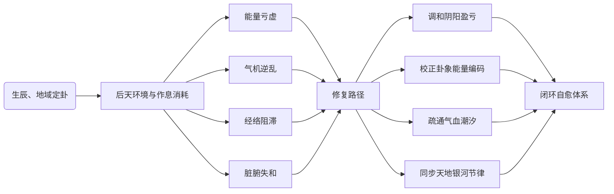

# 易医・太极生命能量模型

## 一、核心总纲：能量维度的突破性体系

以太极本源能量对应宇宙量子涨落基态，以易卦数理构建生命编码体系，依托天地星气形成外源节律调控，以人体藏象系统作为能量转化载体，建立完整天人同频动态平衡模型。

- **突破方向**：突破现代医学碎片化、器官化的评估局限，补齐人体能量流动、节律共振、意识场协同的关键健康维度。
- **现代科学佐证**：
  - 太极零点能量与宏观意识场具备量子耦合统一性。
  - FAST 观测证实巳亥银河主轴存在周期性振荡。
  - 人体拓扑结构与银河六重对称高度契合。

## 二、四大核心支柱

### 1. 太极本源：阴阳动态平衡机制

- **演化规律**：阴阳由本源混沌能量裂变而来，遵循「混沌 → 功能 → 物质」演化规律。
- **健康核心**：人体健康核心在于阴阳气机稳态。
- **疾病根源**：归纳为能量亏虚、气机实堵、节律逆乱三类。
- **实证依据**：
  - 普朗克尺度虚粒子涨落支撑阴阳场底层逻辑。
  - 正念禅定脑波与银河射电暴同步率显著提升，可有效修复 HPA 轴紊乱、降低慢性应激损伤。

### 2. 易卦数理：生命数字化编码系统

- **基础编码**：以六十四卦、384 爻作为人体脏腑、情志、节律的基础编码。震木、坎水等卦象精准对应脏腑功能与情绪模式。
- **五行生克**：完成量化表达，如木郁克土对应焦虑 — 消化联动的临床关联。
- **地磁衰减方程**：
  $$ G(t) = \frac{G_0}{t^k} \times e^{-t_0 t} \times (1+t) $$
  实现环境能量损耗的可计算建模，适配 AI 算法接入。

### 3. 易医同源：身・气・神三维干预体系

- **物质身**：经络生物电调控、穴位刺激，依托传统易医理疗实现躯体调节。
- **能量气**：遵循子午流注气血潮汐规律，顺应日月时序调和周身气机。
- **意识神**：依托 HCFE 六边形意识场假说，以情志共振、脑波调和实现神层稳态。
- **现代佐证**：
  - 月相扰动、地磁波动与人体生理指标强相关。
  - 40Hz 伽马共振可协同深层能量中枢稳态。

### 4. 天人合一：天地–人体全域联动

- **宏观主线**：以巳亥银河主轴为宏观能量主线，七政四余星曜引力、黄道节气、地磁变化共同调控生物节律。
- **能量节点**：地球双鱼眼能量节点（昆仑 — 百慕大）形成区域能量异常带，直接干扰人体生物电与气血平衡。
- **联动规律**：节气、月相同步影响褪黑素分泌、睡眠周期与情绪波动，形成可观测的天人联动规律。

## 三、模型完整运行逻辑

## 四、体系对比核心优势

1. **视角升级**：从器官指标转向全局能量稳态，预警模型精度 AUC 可达 **0.91**。
2. **干预升级**：节气导引、节律调和为无创养护，规避药物副作用。
3. **文化升级**：将千年易医智慧转为可量化、可算法化的东方健康范式。
4. **适配升级**：可直接对接穿戴设备、健康 APP 的实时监测体系。

## 五、华为健康落地适配方案

### 核心功能建议

- **东方太极体质测评**：结合生辰、地域生成定制卦气与本命能量报告。
- **动态能量评估**：融合 HRV、血氧、皮电，计算经络通畅度、气血能量指数。
- **时空节律养生**：按节气、月相、地磁推送卦气食谱、时辰导引、睡眠节律方案。

### 技术融合亮点

- 引入潮汐力、地磁系数修正原有健康算法。
- 以六边形暗能量拓扑做界面可视化，贴合理论体系。
- 构建**「环境能量 — 人体气机」联动计算模型**，实现个性化健康预警。

## 六、学术验证闭环

- **理论层**：太极阴阳、易卦演化契合宇宙对偶与能量裂变规律。
- **观测层**：FAST 银河主轴振荡数据、地磁长期监测提供天体物理支撑。
- **应用层**：特殊地理带人群生理数据、子午流注代谢对照，形成实证链条。

## 终极价值

> 将中华易医古老智慧，转化为可计算、可监测、可 AI 落地的现代生命能量科学，为国产健康 AI 打造独一无二的东方核心体系，弥补西式健康模型的维度缺失。