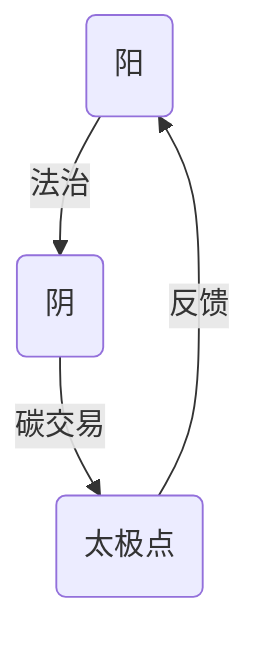

# 东方心性文明与儒释道阴阳太极解析

东方心性文明的核心，在于以儒释道三家为路径，以阴阳太极为底层逻辑，探寻心性、人伦、性命的终极平衡，最终实现个体与天地、自我与万物的和谐共生。三家殊途，阴阳相依，太极居中，共同构成东方文明的精神内核与实践体系。从传统心性修炼到现代实践落地，从理论阐释到制度转译，这套文明体系始终呈现出动态平衡、兼容并蓄的鲜明特质。

## 一、三家之阳：心性、人伦、性命的升华路径

儒释道三家，皆以“阳”为修行与践行的核心方向，分别从心性、人伦、性命三个维度，搭建起东方人修身、处世、合道的完整路径，三者相辅相成，缺一不可，为太极点的动态运作奠定了坚实基础。

### 佛家治心——心性之阳：觉性破迷，慈悲无执

心性之阳，核心是“觉性”，以破除众生无明执念为根本，回归本自具足的圆满佛性。正如《金刚经》所言“应无所住而生其心”，慈悲而不着相，行善而不执果，在觉悟中实现自度与度人。这种觉性并非静态的认知，而是动态的破执过程，与太极“活中”之道高度契合。

实践核心：以禅定修心为根基，通过持戒、观想、念佛等方式，转化贪、嗔、痴三毒，培养戒、定、慧三学，最终达到明心见性、悲智双运的境界，让心性始终保持清净与觉醒。禅宗公案“吃茶去”更直白示现：中道并非抽象理论，而是在担水劈柴、日常琐事中鲜活运作的实践智慧。

### 儒家治世——人伦之阳：仁礼为核，中和为纲

人伦之阳，核心是“仁”，以“仁”为体、“礼”为用，搭建个体与家庭、社会、天下的伦理秩序，实现人伦和谐与社会安定。正如《中庸》所云“致中和，天地位焉，万物育焉”，中和之道，是儒家为人处世、治国安邦的终极准则，其本质是太极“居中”智慧在人伦领域的具体体现。

实践核心：以克己复礼为路径，通过学习经典、践行仁义礼智信，约束自身言行，理顺家庭伦理，进而将这套伦理秩序推广至国家与天下。儒家的权变智慧尤为关键，孔子“无可无不可”与孟子“执中无权，犹执一也”的辩证，正是太极动态平衡思想的生动诠释，避免了伦理规范的僵化与极端。

### 道家治身——性命之阳：顺道而行，无为自化

性命之阳，核心是“顺道”，主张人要顺应天地自然的规律，调和身心，实现性命双修，最终与道合一。正如《道德经》所言“人法地，地法天，天法道，道法自然”，顺应自然，方能无为而无不为，这与太极“顺势而为、阴阳互化”的本质高度统一。

实践核心：以炼气化神为核心，通过养生功法（如太极、导引术）调养身形，通过冥想、坐忘、观照自然体悟大道，摒弃过多欲望与刻意作为，达成形神俱妙、身心合一的状态。《淮南子》“圣人不朽，时变是守”的理念，进一步阐释了道家“顺道”的动态性，其内涵与量子场论真空涨落的隐喻形成奇妙呼应，彰显了东方智慧的现代价值。

## 二、阴之本质：失衡的显化

阴阳相依，无阳则无阴，无阴则无阳。所谓“魔”，并非外在的邪恶实体，而是三家之“阳”走向极端、出现失衡后的显化，是修行与践行过程中需警惕的偏差与误区，也是太极动态平衡被打破的具体表现。

- **佛家之阴**：执迷于“空”或“有”的极端，要么陷入“顽空”，否定一切善恶、因果，要么执着于“有相”，贪求功德、执着于慈悲之名，甚至堕入“慈悲陷阱”——滥施慈悲、纵容恶行，反而背离慈悲本怀。这正是背离佛家“动态中观”，未能“空掉”破执工具本身的失衡。
- **儒家之阴**：将“礼”僵化、教条化，背离“仁”的本质，沦为“以理杀人”的工具，如封建时代的礼教束缚人性、压抑个性，失去了儒家“中庸”“爱人”的核心精神，也违背了“执中有权”的权变智慧，变成了阻碍人伦和谐的枷锁。
- **道家之阴**：将“无为”误解为消极避世、无所作为，逃避社会责任与人生担当；或陷入妄求长生的执念，刻意追求丹药、功法，违背自然规律，反而损伤性命，背离了道家“顺应自然”“时变是守”的根本宗旨，也打破了性命与天地的自然平衡。

## 三、太极点：三家的终极交汇（含动力学诠释）

太极者，阴阳之枢纽也，是阴阳平衡的核心，也是儒释道三家修行与践行的终极交汇点。三家虽路径不同、侧重各异，但最终都指向“居中”之道，以太极点为核心，实现阴阳相济、不偏不倚。这种“居中”并非静态的停滞，而是时空情境中的“活中”，具备鲜明的动力学特征。

| 体系 | 太极点 | 经典依据 |
|------|--------|----------|
| 佛家 | 觉而不迷，悲智双运（动态中观） | 《心经》“照见五蕴皆空，度一切苦厄”、《中论》“八不中道” |
| 儒家 | 中庸至诚，权变合宜（执中有权） | 《论语》“过犹不及”“君子时中”、《孟子》“执中无权，犹执一也” |
| 道家 | 无为而治，阴阳互根（时变是守） | 《庄子》“坐忘”“吾丧我”、《淮南子》“圣人不朽，时变是守” |

### 共同内核：心、行皆居中，阴阳自平衡

- **心居中**：佛家的“明心见性”，是让心性不执于空有、不迷于执念，保持清明觉醒；儒家的“正心诚意”，是让本心归于仁义、不偏不倚，坚守道德底线；道家的“虚心实腹”，是让心神清净、不被欲望裹挟，回归本真状态。三者虽表述不同，核心都是让“心”处于阴阳平衡的太极点上。
- **行居中**：不堕极端，不执一端，追求动态平衡。如儒家的“时中”，根据时代与情境的变化，灵活践行仁义礼智，不僵化、不迂腐；道家的“冲气以为和”，让阴阳二气相互调和，不刻意、不妄为；佛家的“不即不离”，在入世与出世之间找到平衡，慈悲度人而不执于相。这种动态平衡，在现代企业战略中亦有映射，如华为“灰度管理”，正是太极“活中”智慧的现代实践。

### 太极点的动力学诠释

太极点并非静态的“中点”，而是时空情境中不断运作的“活中”，是阴阳互化的核心引擎，其动力学特征可通过理论阐释与数学表达进一步明晰。

1. **时空情境中的“活中”**：三家对“中”的践行，均体现出动态适配的特质。佛家动态中观，龙树《中论》“八不中道”（不生不灭、不断不常、不一不异、不来不出）实为破执工具，其本身亦需“空掉”，避免陷入新的执念；禅宗公案“吃茶去”更将这种动态性具象化——中道不在言句中，而在担水劈柴、日常行事的鲜活运作中。儒家权变智慧，以孔子“无可无不可”与孟子“执中无权，犹执一也”为核心，强调“中”并非固定不变的标准，而是根据情境灵活调整的实践智慧，这与现代企业战略中的“动态平衡”（如华为“灰度管理”）高度契合。道家环中妙用，《淮南子》“圣人不朽，时变是守”明确提出顺应时代变化的核心主张，其内涵与量子场论真空涨落的隐喻形成呼应，暗示太极点的动态运作与天地自然的本质规律同频。

2. **太极作为生成界面**：太极点是阴阳互化的生成核心，其运作规律可通过数学方式初步表达。定义太极算子：

   $$
   \hat{T} = \lim_{\Delta \to 0} \frac{阳(\Delta) - 阴(-\Delta)}{2\Delta}
   $$

   该算子描述了阴阳互化的瞬时速率，直观体现了太极点作为阴阳转化枢纽的动力学本质，为东方心性智慧的量化解读提供了初步框架。

## 四、三教合一的拓扑结构

儒释道三教合一，并非简单的理论融合，而是呈现出鲜明的拓扑结构——三者终极境界不同、不可化约，却相互镜鉴、相互补充，形成“终点分形、互为阴阳”的有机整体，共同构成东方心性文明的完整体系。

### 终点的分形特征

三教的终极境界虽有本质差异，却各自对应现代系统理论的核心特质，呈现出不可化约的分形特征，具体如下：

| 体系 | 终极境界 | 现代转译 | 不可化约性 |
|------|----------|----------|------------|
| 佛家 | 涅槃 | 复杂系统自指性破缺 | 对轮回本体的彻底否定 |
| 儒家 | 参赞化育 | 社会系统的涌现秩序 | 对现世责任的绝对肯定 |
| 道家 | 逍遥无待 | 混沌系统中的自由涨落 | 对人为规范的终极解构 |

### 互为镜鉴的阴阳网

三教的拓扑结构，本质是互为镜鉴、相互约束的阴阳网，历史上诸多案例均体现了这种互补性，避免了单一体系的极端化。王阳明“良知说”吸收禅宗“明心见性”的核心智慧，却以儒家“事上磨练”为实践路径，有效防范了禅宗“空谈心性、脱离现实”的禅病；全真道“三教圆融”理念，以儒家伦理规范约束丹道修炼的妄念，避免了道家“消极避世”或“妄求长生”的偏差，实现了三家智慧的有机融合。

## 五、制度性转译的实践路径

东方心性文明的价值，不仅在于理论阐释，更在于落地实践。将儒释道与太极智慧进行制度性转译，应用于科技伦理、生态治理、教育体系等现代领域，是古老智慧焕发新生的关键路径。

### 科技伦理的三重编码

以三家智慧为核心，构建科技伦理的三重编码体系，破解现代科技发展的伦理困境：

1. **佛家层**：以“破无明”为核心，提出算法透明性要求，破除“技术黑箱”带来的认知壁垒，让技术运作可追溯、可监督，避免技术被滥用而陷入“无明”困境；
2. **儒家层**：以“仁义”为核心，强调AI开发者的责任伦理，提出“己所不欲勿施于AI”的实践准则，要求开发者将伦理责任融入技术研发全过程，兼顾技术进步与社会福祉；
3. **道家层**：以“无为而治”为核心，倡导技术系统的自组织容错，如区块链“去中心化”架构，无需外在强制干预，即可实现系统的自我调节与平衡，契合道家“顺应自然”的智慧。

### 生态治理的太极模型

基于太极阴阳平衡理念，构建生态治理的太极模型，实现政策、市场与社区的动态协同，具体逻辑如下：



政策刚性（阳）提供法治保障，明确生态治理的底线与标准；市场柔性（阴）通过碳交易等市场化手段，激发生态保护的内生动力；社区自治作为太极点，承接政策与市场的联动，通过居民参与实现生态治理的动态平衡，形成“政策引导、市场驱动、社区参与”的良性循环。

### 教育体系的改革试点

将三家智慧融入教育体系，开设“三慧课程”，实现学生心性、伦理、身心的全面发展，具体模块设计如下：

1. **佛家模块**：以正念注意力训练为核心，帮助学生觉察念头、缓解焦虑，培养专注、清净的心智状态；
2. **儒家模块**：以项目制伦理决策为核心，通过模拟现实场景，引导学生践行仁义礼智信，培养责任意识与伦理判断能力；
3. **道家模块**：以自然观察与身体觉知为核心，引导学生亲近自然、感知天地规律，培养顺应自然、身心和谐的生活态度。

## 六、观者悖论与开放性终结

东方心性文明的终极探索，始终面临“观者悖论”的困境——如同量子力学“观测者效应”，任何对太极的言说、对三家智慧的阐释，本身已破坏其完整性与绝对性，因为太极的本质是超越语言、超越认知的“中道”。

### 元认知的递归困境

这种困境本质是元认知的递归困境：我们试图用理性认知去把握超越理性的太极之道，用语言文字去描述不可言说的终极境界，必然会陷入“言不尽意”的局限。解决方案可借鉴维特根斯坦式“梯子隐喻”——所有的理论阐释、框架构建，都只是“用完即弃”的临时工具，其价值在于引导我们接近真理，而非成为束缚我们的新执念。

### 对话机制的构建

破解观者悖论的关键，不在于追求绝对的真理阐释，而在于构建开放的对话机制。建立“三教辩经”现代版，每期聚焦具体议题（如基因编辑伦理、人工智能治理等），强制角色轮换（佛教徒需从儒家立场发言，儒家学者需从道家立场思考），通过多元视角的碰撞，打破单一认知的局限，接近太极“中和”的本质。

真正的银心不在星空，而在每个觉醒者胸中的太极引擎——它驱动着永恒的思想超新星爆发。东方心性文明的终极价值，不在于构建一个封闭的理论体系，而在于提供一种开放的实践路径，让每个人都能在太极阴阳的平衡中，实现心性、人伦、性命的圆满，让古老的东方智慧，在现代社会持续焕发新的生命力。
```

**格式说明**：
- 使用一级标题 `#` 和二级标题 `##`、三级标题 `###` 保持层级。
- 列表使用 `-` 或数字编号。
- 表格用 Markdown 管道符绘制。
- Mermaid 图用 ` ```mermaid ` 代码块包裹。
- 数学公式用 `$$` 块级 LaTeX 渲染（需平台支持）。
- 无多余空格或错误，可直接发布。